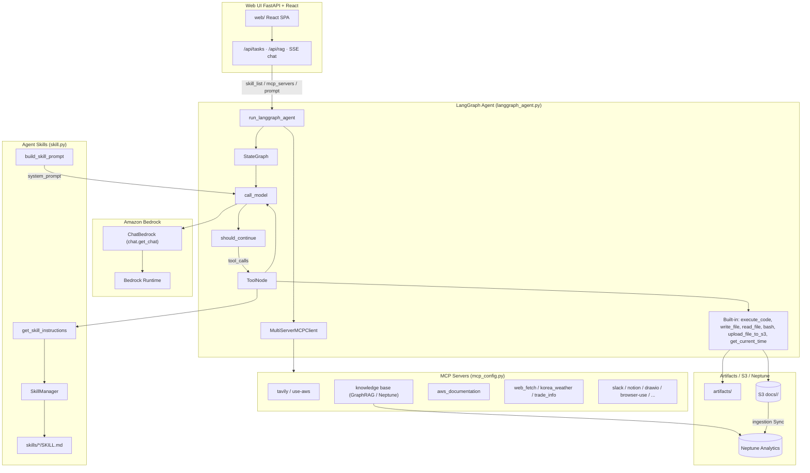
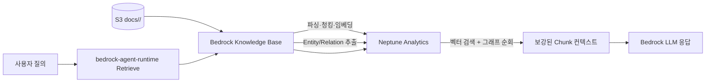

# GraphRAG와 함께 Agent 구현하기

여기에서는 Amazon Bedrock Knowledge Bases를 이용해 GraphRAG로 구현합니다. 사용자는 **FastAPI + React** 로 구현된 Web UI로 접속하여 문서를 업로드 하고 검색할 수 있습니다. LangGraph Agent를 이용해 MCP와 Skill을 활용할 수 있습니다. 인터넷 검색은 AgentCore Gateway를 이용한 websearch를 이용해 구현됩니다.


## Architecture

전체적인 동작은 아래를 참조합니다. 



| UI / API | 모듈 | 설명 |
|------|------|------|
| Task Chat (SSE) | `api/routes_chat` → `langgraph_agent.run_langgraph_agent` | Skill + MCP LangGraph Agent, 스트리밍 |
| RAG Upload | `api/routes_rag` → Bedrock KB sync | 문서 업로드 후 GraphRAG 인제스션 |
| Config | `api/routes_config` | 모델·Skill·MCP 선택 |


## Graph RAG

이 프로젝트의 RAG는 **Amazon Bedrock Knowledge Bases GraphRAG + Amazon Neptune Analytics** 기반입니다. 벡터 유사도 검색에 Entity/관계 그래프 순회를 결합해 멀티홉·크로스 도큐먼트 질의에 대응합니다. 상세 개념은 [aws_graphrag_neptune_guide.md](./aws_graphrag_neptune_guide.md)를 참고하세요.

### 아키텍처



| 구성 | 값 |
|------|-----|
| 벡터 스토어 | Neptune Analytics (`NEPTUNE_ANALYTICS`) |
| 그래프 이름 | `rag-project` |
| 용량 | 32 m-NCU (POC) |
| 임베딩 | Titan Text Embeddings V2, 1024차원, FLOAT32 |
| 문서 파서 | Foundation model — Claude Sonnet 4.6 |
| 그래프 구성 모델 | Claude Haiku 4.5 (`CHUNK_ENTITY_EXTRACTION`) |
| 청킹 | Fixed size 300 토큰 / overlap 20% |
| 데이터 소스 | S3 `docs/{projectName}/` prefix |

인제스션 시 Knowledge Base가 Document → Chunk → Entity 노드와 `PART_OF` / `HAS_ENTITY` / 동적 관계 엣지를 Neptune에 적재합니다. 검색 시에는 질문 벡터로 유사 Chunk를 찾은 뒤 Entity 그래프를 확장해 컨텍스트를 보강합니다.

### 인프라 (`installer.py`)

아래와 같이 python, pip, git, boto3를 설치합니다.

```text
sudo yum install python3 python3-pip git docker -y
pip install "boto3>=1.43.32" "botocore>=1.43.32"
```

아래와 같이 git source를 가져옵니다.

```python
git clone https://github.com/kyopark2014/graph-rag
```

아래와 같이 installer.py를 이용해 설치를 시작합니다.

```python
cd graph-rag && python3 installer.py
```

배포 시 아래를 생성·갱신합니다.

1. **공용** S3 버킷 (`storage-for-rag-project-{account}-{region}`) — agent-skills 등과 공유, 없으면 생성
2. Knowledge Base IAM 역할 — `neptune-graph:GetGraph`, `Read/Write/DeleteDataViaQuery`
3. Neptune Analytics 그래프 + 벡터 인덱스 (차원 1024) — 프로젝트 전용
4. Bedrock Knowledge Base + GraphRAG 데이터 소스 (FM parser Sonnet 4.6, graph construction Haiku 4.5, prefix `docs/{projectName}/`) — 프로젝트 전용
5. **공용** CloudFront (`CloudFront-for-rag-project`), AgentCore Web Search Gateway (`gateway-websearch`) — 없으면 생성·재사용

정리 시 Knowledge Base를 먼저 삭제한 뒤 Neptune 그래프를 삭제하세요. 순서를 바꾸면 KB가 깨지거나 그래프 과금이 남을 수 있습니다. S3 / CloudFront / Web Search Gateway는 **공용 리소스**이므로 uninstaller가 기본값 N으로 유지 여부를 묻습니다.

```bash
python uninstaller.py --delete-knowledge-base --delete-neptune
```

`application/config.json`에는 다음 키가 기록됩니다.

| 키 | 설명 |
|----|------|
| `knowledge_base_id` / `knowledge_base_name` | GraphRAG KB (프로젝트 전용) |
| `neptune_graph_id` / `neptune_graph_arn` / `neptune_graph_name` | Neptune Analytics 그래프 (프로젝트 전용) |
| `s3_bucket` / `sharing_url` | 공용 문서 저장소 및 CloudFront |
| `agentcore_websearch_gateway_*` | 공용 Web Search Gateway |

### 검색 경로

| 경로 | 모듈 | 역할 |
|------|------|------|
| knowledge base MCP | `mcp_retrieve` / `mcp_server_retrieve` | GraphRAG retrieve |
| RAG upload API | `api/routes_rag` | S3 업로드 + KB sync |
| Agent chat | `langgraph_agent` + knowledge base MCP | 도구로 KB 검색 후 답변 |

| Agent MCP | `mcp_server_retrieve.py` → `mcp_retrieve.py` | `knowledge base` MCP 도구로 동일 KB 검색 |

`mcp_retrieve.retrieve()`는 `bedrock-agent-runtime`의 `Retrieve` API를 호출합니다. Knowledge Base가 Neptune Analytics에서 벡터 검색과 Entity 그래프 순회를 수행한 뒤 보강된 Chunk를 반환합니다. 참조 메타데이터의 `from` 필드는 `GraphRAG`입니다.

문서 반영 절차:

1. 파일을 `s3://{s3_bucket}/docs/{projectName}/`에 업로드
2. Bedrock 콘솔(또는 API)에서 Knowledge Base **Sync**
3. Sync 완료 후 RAG / Agent(`knowledge base` MCP)로 질의

### Metadata Filtering

Amazon Bedrock Knowledge Bases는 원본 문서와 함께 `파일명.확장자.metadata.json`을 S3에 올리면 문서별 커스텀 메타데이터를 인덱싱할 수 있습니다. 조회 시 `Retrieve` / `RetrieveAndGenerate`의 `vectorSearchConfiguration.filter`로 사전 필터링한 뒤 유사도 검색을 수행합니다.

이 프로젝트는 UI/API RAG 업로드 시 `application/services/rag_service.py`가
`docs/{projectName}/{user_id}/{file}.metadata.json` sidecar를 함께 올립니다.

#### Neptune GraphRAG에서 허용되는 타입

Neptune Analytics(GraphRAG) 문서 메타데이터는 **STRING / NUMBER / BOOLEAN**만 지원합니다.
`STRING_LIST`(list 값)는 **인제스션 시 파일이 무시**됩니다.

| 속성 | 타입 | 예시 | 용도 |
|------|------|------|------|
| `owner` | `STRING` | `"user01"` | 업로더 `user_id` (단일 문자열) |
| `team` | `STRING` | `"mycompany"` | 팀/조직 스코프 |
| `created_time` | `NUMBER` | `1786366000` | Unix epoch(초). 범위 필터용 |
| `is_confidential` | `BOOLEAN` | `false` | 기밀 여부 |

> **OpenSearch용 `STRING_LIST` owner와의 차이**  
> `agent-skills` 등 OpenSearch 기반 RAG는 `owner`를 `STRING_LIST`로 두고 `listContains`로 필터할 수 있습니다.  
> GraphRAG(Neptune)에서는 list 속성이 거부되므로 **반드시 `STRING` + `equals` / `in`** 을 사용합니다.  
> 구현: `build_kb_metadata_document(owner=...)` → `type: "STRING"`.

메타데이터 파일 예시 (`error_code.pdf.metadata.json`):

```json
{
  "metadataAttributes": {
    "owner": {
      "value": { "type": "STRING", "stringValue": "user01" },
      "includeForEmbedding": false
    },
    "team": {
      "value": { "type": "STRING", "stringValue": "mycompany" },
      "includeForEmbedding": false
    },
    "created_time": {
      "value": { "type": "NUMBER", "numberValue": 1786366000 },
      "includeForEmbedding": false
    },
    "is_confidential": {
      "value": { "type": "BOOLEAN", "booleanValue": false },
      "includeForEmbedding": false
    }
  }
}
```

조회 시 필터 예시 (`owner`는 `equals` / `in` — `listContains` 사용 금지):

```python
retrievalConfiguration={
    "vectorSearchConfiguration": {
        "filter": {
            "andAll": [
                {"equals": {"key": "owner", "value": "user01"}},
                {"equals": {"key": "team", "value": "mycompany"}},
            ]
        }
    }
}
```

| 항목 | OpenSearch Serverless | S3 Vectors | Neptune Analytics |
|------|----------------------|------------|-------------------|
| `equals` / `notEquals` | ✅ | ✅ | ✅ |
| 숫자 비교 (`>`, `<`, `>=`, `<=`) | ✅ | ✅ | ✅ |
| `in` / `notIn` | ✅ (가장 잘 지원) | 제한적 | ✅ (잘 지원) |
| `startsWith` | ✅ | ❌ | ✅ (가능하나 느림, 비권장) |
| `stringContains` | ✅ | ❌ | ✅ (string만, list variant ❌) |
| `listContains` / list형 메타데이터 | ✅ | 제한/이슈 있음 | ❌ (문서 메타에 list 속성 미지원) |

#### 트러블슈팅: invalid metadata attributes

Sync 실패 메시지가 아래와 같으면 sidecar의 `owner`(또는 기타 속성)가 `STRING_LIST`일 가능성이 큽니다.

```text
Ignored 1 files due to invalid metadata attributes.
Check that the attribute keys and values don't exceed the character quota,
and that the attribute values are acceptable data types (strings, numbers, or Booleans).
Then retry your request [Files: s3://.../docs/graph-rag/{user}/{file}.pdf].
Call to Customer Source did not succeed.
```

조치:

1. `.metadata.json`에서 `owner`를 `STRING`(`stringValue`)으로 수정  
2. S3에 sidecar 재업로드  
3. Knowledge Base **Sync** 재실행  

**실무 팁**

- `department`, `year`, `region` 같은 카탈로그성 속성은 세 스토어 모두에서 안전하게 쓸 수 있습니다.
- 경로 prefix·부분 문자열·태그 리스트 필터가 필요하면 OpenSearch가 가장 여유롭습니다.
- Neptune에서는 String / Number / Boolean만 문서 메타 속성으로 권장합니다. `startsWith`보다 전용 카테고리 속성을 두고 `equals` / `in`을 쓰는 편이 지연시간에 유리합니다.
- 새 메타데이터 속성을 추가한 뒤에는 소스 문서를 갱신하고 Knowledge Base를 **재동기화(Sync)** 해야 필터에 반영됩니다.

참고: [Configure queries and response generation](https://docs.aws.amazon.com/bedrock/latest/userguide/kb-test-config.html), [Neptune GraphRAG filter best practices](https://docs.aws.amazon.com/neptune-analytics/latest/userguide/best-practices-graphrag-filters.html)

### 비용분석

OpenSearch Serverless RAG와 Neptune Analytics GraphRAG의 월간 운영비를 비교합니다.

**기준**: `us-east-1`, 2026년 7월, Titan Embeddings V2 + Claude Sonnet 3.5(응답). 단가는 AWS 공개 요금표 기준 추정치이며 리전·약정·사용 패턴에 따라 달라질 수 있습니다.

#### 단가

| 항목 | OpenSearch Serverless (NextGen) | Neptune Analytics |
|------|--------------------------------|-------------------|
| 컴퓨트 단가 | $0.24 / OCU-hour | ~$0.015 / m-NCU-hour |
| 스토리지 | $0.024 / GB-month | $0.021 / GB-month (snapshot) |
| 최소 월 비용 (상시) | ~$175 (dev, 1 OCU) / ~$350 (prod, 2 OCU) | ~$350 (32 m-NCU) |
| 유휴 과금 | NextGen은 scale-to-zero 가능 | Pause 시 정상 요금의 약 10% |

#### 시나리오별 월간 총 운영비용

| 규모 | OpenSearch RAG | GraphRAG (Neptune) | 격차 |
|------|----------------|--------------------|------|
| 소규모 (1K 문서, 쿼리 100건/일) | $216/월 | $391/월 | Neptune 약 1.81배 |
| 중규모 (10K 문서, 쿼리 1K건/일) | $756/월 | $1,106/월 | Neptune 약 1.46배 |
| 대규모 (100K 문서, 쿼리 1만건/일) | $4,752/월 | $5,454/월 | Neptune 약 1.15배 |

규모가 커질수록 격차가 줄어드는 이유는 **LLM 응답 생성 비용(공통)** 이 전체 비용에서 차지하는 비중이 커지기 때문입니다.

#### Neptune 전용 추가 비용

| 항목 | 설명 | 예상 비용 (1회성) |
|------|------|------------------|
| Graph 구성 LLM | Entity 추출 (Claude Haiku 4.5) | 1K 문서 ~$1.5 / 100K 문서 ~$150 |
| 인제스션 임베딩 | 양측 공통 | 상대적으로 미미 |

#### 비용 절감 전략

| 전략 | OpenSearch | Neptune |
|------|------------|---------|
| 사용 패턴 최적화 | NextGen scale-to-zero (cold start 약 10–30초) | Pause → 업무시간만 운영 시 최대 약 66% 절감 |
| 약정 할인 | N/A | Database Savings Plans 1년 = 최대 약 35% 절감 (2026.03~) |
| 극한 절감 조합 | — | 32 m-NCU + Pause + Savings Plans → 약 **$85–120/월** |

#### 선택 기준

| 선택 기준 | OpenSearch RAG | GraphRAG (Neptune) |
|-----------|----------------|--------------------|
| 비용 우선 | 유리 | 상대적으로 비쌈 |
| 단순 벡터 검색 | 충분 | 과투자일 수 있음 |
| Multi-hop 추론 | 취약 | 강점 |
| 크로스 문서 관계 분석 | 제한적 | 강점 |
| 응답 품질 최우선 | 보통 | 우수 |
| POC / 테스트 | 저비용 시작 용이 | Pause로 유휴 비용 절감 가능 |

**정리**: 순수 인프라 비용만 보면 OpenSearch Serverless가 유리합니다. 다만 Multi-hop 추론·엔티티 관계·크로스 도큐먼트 분석이 필요하면 Neptune GraphRAG의 추가 비용을 감수할 가치가 있습니다. 이 프로젝트는 후자(GraphRAG)를 기본으로 합니다.


## MCP

Settings에서 **knowledge base** MCP를 선택하면 LangGraph Agent가 stdio로 `mcp_server_retrieve.py`를 띄우고, 도구 `retrieve`로 GraphRAG Knowledge Base를 조회합니다. UI 표시명은 `knowledge base`, `mcp_config.load_config()` 내부 키는 `kb-retriever`입니다.

```text
Agent (langgraph_agent)
  → mcp_config.load_config("knowledge base")
  → python mcp_server_retrieve.py  (FastMCP, transport=stdio)
  → @mcp.tool retrieve(keyword)
  → mcp_retrieve.retrieve(query)
  → bedrock-agent-runtime Retrieve API
  → Neptune Analytics GraphRAG (벡터 검색 + Entity 그래프 순회)
```

### `mcp_server_retrieve.py` — MCP 서버 래퍼

FastMCP 서버 `mcp-retrieve`를 정의하고, 도구 하나만 노출합니다. 실제 검색 로직은 전부 `mcp_retrieve`에 위임합니다.

| 구성 | 설명 |
|------|------|
| `mcp = FastMCP(name="mcp-retrieve")` | MCP 서버 인스턴스 |
| `@mcp.tool() retrieve(keyword: str) -> str` | Agent가 호출하는 도구. docstring이 도구 설명으로 전달됨 |
| `mcp.run(transport="stdio")` | `__main__`에서 stdio로 실행 |

```python
# application/mcp_server_retrieve.py
@mcp.tool()
def retrieve(keyword: str) -> str:
    """Query the knowledge base with GraphRAG (Neptune Analytics). ..."""
    return mcp_retrieve.retrieve(keyword)
```

### `mcp_retrieve.py` — Bedrock Retrieve 구현

모듈 로드 시 `config.json`에서 `region`, `projectName`, `knowledge_base_id` / `knowledge_base_name`, `sharing_url`을 읽고 `bedrock-agent-runtime` 클라이언트를 생성합니다. (config에 AWS 키가 있으면 명시 credential, 없으면 IAM/환경 기본값)

| 함수 | 역할 |
|------|------|
| `load_config()` | `application/config.json` 로드 |
| `_resolve_knowledge_base_id()` | 이름으로 KB를 찾아 `knowledge_base_id`를 config에 갱신 |
| `retrieve(query)` | `Retrieve` API 호출 후 JSON 문자열로 반환 |

**`retrieve(query)` 흐름**

1. `bedrock_agent_runtime_client.retrieve()` 호출  
   - `retrievalQuery.text` = 질의  
   - `knowledgeBaseId` = config의 ID  
   - `numberOfResults` = 5 (기본)
2. `ResourceNotFoundException`이면 `_resolve_knowledge_base_id()`로 ID를 재조회한 뒤 1회 재시도
3. 각 `retrievalResults` 항목을 정규화:

```json
{
  "contents": "<chunk text>",
  "reference": {
    "url": "<CloudFront sharing_url>/docs/<projectName>/<file>",
    "title": "<파일명>",
    "from": "GraphRAG",
    "page": 1
  }
}
```

- S3 location → `sharing_url` + `docs/{projectName}/`로 다운로드 URL 구성  
- Bedrock 페이지 번호(`x-amz-bedrock-kb-document-page-number`, 0-based) → 표시용 1-based `page`  
- `from`은 항상 `"GraphRAG"` (Neptune GraphRAG 경로임을 UI/인용에 표시)

반환값은 `json.dumps([...], ensure_ascii=False)` 문자열이라 MCP ToolMessage로 Agent에 그대로 전달됩니다.

### 등록 (`mcp_config.py`)

```python
# mcp_type "knowledge base" → "kb-retriever"
"kb_retriever": {
    "command": "python",
    "args": [f"{workingDir}/mcp_server_retrieve.py"]
}
```

## Agent

에이전트 config는 `create_agent()`에서 생성하며, `history_mode`와 관계없이 `max_turns`를 전달합니다.

```python
# application/langgraph_agent.py — create_agent()
    if history_mode == "Enable":
        app = buildChatAgentWithHistory(tools)
        config = {
            "recursion_limit": 500,
            "configurable": {"thread_id": chat.user_id},
            "tools": tools,
            "system_prompt": system_prompt,
            "max_turns": MAX_CONTEXT_TURNS,
        }
    else:
        app = buildChatAgent(tools)
        config = {
            "recursion_limit": 500,
            "configurable": {"thread_id": chat.user_id},
            "tools": tools,
            "system_prompt": system_prompt,
            "max_turns": MAX_CONTEXT_TURNS,
        }
```

**`max_turns=5`의 의미**

- **사용자 HumanMessage 5개**와, 각 턴에 이어진 **모든 후속 메시지**를 유지
- 1턴 = `HumanMessage` 1개 + 그 뒤의 `AIMessage`, `ToolMessage`, 도구 feedback loop 전체
- 도구를 여러 번 호출해도 **같은 사용자 질문이면 1턴**으로 카운트

**예 (도구 사용 포함)**

```
Human(Q1) → AI(tool_calls) → ToolMessage → AI(A1)
Human(Q2) → AI(A2)
Human(Q3) → AI(tool_calls) → ToolMessage → AI(A3)
```

`max_turns=2`이면 **Q2부터** 유지:

```
Human(Q2) → AI(A2) → Human(Q3) → AI(tool_calls) → ToolMessage → AI(A3)
```

**메시지 개수 trim과의 차이**

| 방식 | `N=5`일 때 |
|------|------------|
| 이전 (메시지 개수) | 메시지 객체 5개만 유지 → 도구 루프 때문에 사용자 턴 수가 불규칙 |
| 현재 (HumanMessage 턴) | 사용자 질문 5개 + 각 턴의 AI/Tool 응답 전체 유지 |

**Checkpointer와의 관계**

- `history_mode=Enable`일 때 `MemorySaver` checkpointer에는 **전체 대화 이력**이 저장됩니다.
- trim은 LLM 컨텍스트 윈도우 관리용이며, 저장된 history를 삭제하지 않습니다.
- 로그에서 `trimmed messages from X to Y (max_turns=5)`로 trim 여부를 확인할 수 있습니다.


### 그래프 조회

- KB 생성 시 **그래프 구축용 파운데이션 모델**과 **임베딩 모델**을 지정하면, Bedrock이 S3 문서에서 엔티티·관계를 자동으로 추출해 **Neptune Analytics 그래프**에 저장합니다.
- 검색 시 ①벡터 검색 → ②관련 그래프 노드/청크 확장 → ③그래프 순회로 컨텍스트를 풍부하게 만드는 방식입니다.
- 그래프 스키마를 직접 정의하거나 openCypher/Gremlin으로 그래프를 만드는 건 아니고, **조회는 가능**합니다.

#### 그래프 직접 조회하는 방법

Neptune Analytics의 **`ExecuteQuery` API**(openCypher 지원)로 조회하면 됩니다.

**AWS CLI 예시:**
```bash
aws neptune-graph execute-query \
  --graph-identifier <g-xxxxxxxx> \
  --region <region> \
  --query-string "MATCH (a)-[r]->(b) RETURN a, r, b LIMIT 100" \
  --language open_cypher \
  /dev/stdout
```

**boto3(Python) 예시:**
```python
import boto3
client = boto3.client("neptune-graph", region_name="us-east-1")
resp = client.execute_query(
    graphIdentifier="g-xxxxxxxx",
    queryString="MATCH (a)-[r]->(b) RETURN a, r, b LIMIT 100",
    language="OPEN_CYPHER",
)
```

필요 권한(IAM): `neptune-graph:ReadDataViaQuery` (읍기용), 그래프 식별자(`graph-identifier`)는 KB 콘솔의 Vector store 설정에서 확인 가능합니다.

참고: `RetrievalFilter`의 `listContains`, list형 `stringContains` 필터는 Neptune Analytics 그래프에서 미지원이라는 제약이 있습니다.

#### 시각화

조회 결과(노드 a, 관계 r, 노드 b)를 `networkx` + `matplotlib`으로 그리면 관계도를 그림으로 볼 수 있습니다. 실행 가능한 스크립트를 만들어 드렸어요 (graph-id, region만 넣으면 바로 조회+시각화):

- 스크립트: [graphrag_query_example.py](./graphrag_query_example.py)
  ```bash
  python graphrag_query_example.py --graph-id g-xxxxxxxx --region us-east-1
  ```

- 예시 결과 이미지(모의 데이터로 만든 관계도 예시, 실제 조회 전 형태 참고용): [graphrag_example_visualization.png](./graphrag_example_visualization.png)

### Graph RAG 제약사항

| 항목 | 내용 |
|---|---|
| 데이터소스 | GraphRAG는 **S3만 지원** |
| 그래프 커스터마이징 | 그래프 빌드 방식 자체는 커스터마이징 불가(모델만 선택) |
| 오토스케일링 | Neptune Analytics graph는 오토스케일링 미지원 |
| KB 삭제 시 | KB 먼저 삭제 → 그래프는 별도로 삭제해야 함(자동 삭제 안 됨, 안 지우면 과금 계속됨) |
| 계층적 청킹 사용 시 | GraphRAG는 child chunk만 검색(parent로 치환 안 됨) |
| 시각화 툴 | Neptune 콘솔의 오픈소스 **Graph Explorer**로도 그래프 탐색·시각화 가능(자연어 질의는 미지원, 순수 탐색용) |


## 배포하기

아래와 같이 git source를 가져옵니다.

```python
git clone https://github.com/kyopark2014/graph-rag
```

아래와 같이 installer.py를 이용해 설치를 시작합니다. Neptune Analytics 그래프와 Bedrock Knowledge Base(GraphRAG)가 함께 생성됩니다. S3 / CloudFront / Web Search Gateway는 agent-skills와 동일한 공용 리소스를 재사용합니다.

```python
cd graph-rag && python3 installer.py
```

인프라가 더이상 필요없을 때에는 Knowledge Base를 먼저 삭제한 뒤 Neptune 그래프를 삭제합니다. S3 / CloudFront / Web Search는 공용 리소스이므로 기본값이 유지(N)이며, 삭제하려면 프롬프트에서 Y를 입력하거나 `--delete-s3-bucket` / `--delete-cloudfront` / `--delete-agentcore-gateway` 플래그를 사용합니다.

```text
python uninstaller.py --delete-knowledge-base --delete-neptune
```

### 실행하기

AWS 환경을 잘 활용하기 위해서는 [AWS CLI를 설치](https://docs.aws.amazon.com/ko_kr/cli/v1/userguide/cli-chap-install.html)하여야 합니다. EC2에서 배포하는 경우에는 별도로 설치가 필요하지 않습니다. Local에 설치시는 아래 명령어를 참조합니다.

```text
curl "https://awscli.amazonaws.com/awscli-exe-linux-x86_64.zip" -o "awscliv2.zip" 
unzip awscliv2.zip
sudo ./aws/install
```

AWS credential을 아래와 같이 AWS CLI를 이용해 등록합니다.

```text
aws configure
```

설치하다가 발생하는 각종 문제는 [Kiro-cli](https://aws.amazon.com/ko/blogs/korea/kiro-general-availability/)를 이용해 빠르게 수정합니다. 아래와 같이 설치할 수 있지만, Windows에서는 [Kiro 설치](https://kiro.dev/downloads/)에서 다운로드 설치합니다. 실행시는 셀에서 "kiro-cli"라고 입력합니다. 

```python
curl -fsSL https://cli.kiro.dev/install | bash
```

venv로 환경을 구성하면 편리하게 패키지를 관리합니다. 아래와 같이 환경을 설정합니다.

```text
python -m venv .venv
source .venv/bin/activate
```

이후 다운로드 받은 github 폴더로 이동한 후에 아래와 같이 필요한 패키지를 추가로 설치 합니다.

```text
pip install -r requirements.txt
```

이후 아래와 같이 Web UI를 빌드하고 FastAPI를 실행합니다.

```text
# 프론트 빌드 후 uvicorn (포트 8501)
./run_local.sh

# 또는 수동
cd application/web && npm install && npm run build && cd ../..
uvicorn application.server:app --host 0.0.0.0 --port 8501
```

개발 시 Vite 핫리로드:

```text
# 터미널 1
uvicorn application.server:app --host 0.0.0.0 --port 8501

# 터미널 2
cd application/web && npm run dev   # http://localhost:5173  (/api → :8501 프록시)
```

## 실행 결과

입력창에서 '+'을 선택하고 [Uplaod to RAG]를 선택한 후에 "error_code.pdf"를 업로드 합니다. 이후 Settings / MCP에서 아래와 같이 "knowledge base" MCP를 선택합니다.


이후 아래와 같이 "knowledge base로 물과 관련된 보일러 에러 코드 검색하세요."라고 입력합니다. 이때의 결과는 아래와 같습니다.


## Reference

[Amazon Bedrock Knowledge Bases GraphRAG](https://docs.aws.amazon.com/bedrock/latest/userguide/knowledge-base-build-graphs.html)

[Amazon Neptune Analytics](https://docs.aws.amazon.com/neptune-analytics/latest/userguide/)

[aws_graphrag_neptune_guide.md](./aws_graphrag_neptune_guide.md) — 이 저장소의 GraphRAG 개념·운영 가이드

[anthropics / skills](https://github.com/anthropics/skills)

[Agent Skills](https://agentskills.io/home)

[Notion Skills for Claude](https://www.notion.so/notiondevs/Notion-Skills-for-Claude-28da4445d27180c7af1df7d8615723d0)

[Claude Code Skills](https://support.claude.com/en/articles/12512176-what-are-skills)

[example skills](https://github.com/anthropics/skills)

[Agent Skills for Strands Agents SDK](https://github.com/aws-samples/sample-strands-agents-agentskills)

[Claude Code Plugins: Orchestration and Automation](https://github.com/wshobson/agents/tree/main)

[Deep Agents CLI](https://github.com/langchain-ai/deepagents/tree/master/libs/cli)

[Using skills with Deep Agents CLI](https://www.youtube.com/watch?v=Yl_mdp2IiW4)

[Open Agent Skills](https://skills.sh/)
