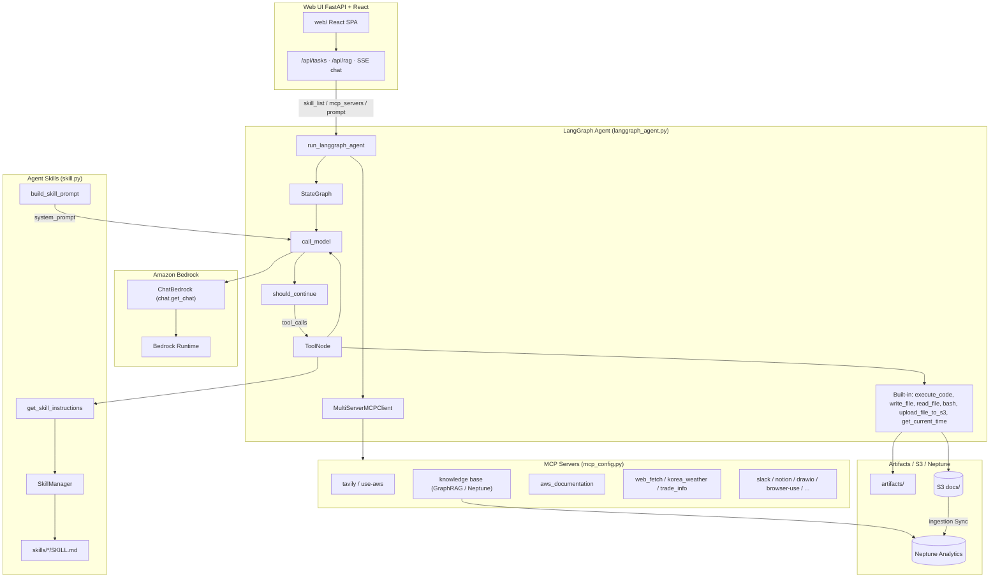
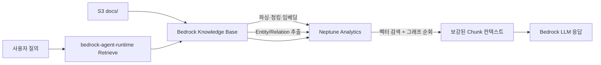

# GraphRAG와 함께 Agent 구현하기

Agent는 MCP뿐 아니라 [Skill](https://github.com/anthropics/skills)을 활용하여 다양한 기능을 편리하게 구현할 수 있습니다. 여기에서는 [LangGraph](https://www.langchain.com/langgraph)에서 Agent skill을 활용하는 방법에 대해 설명합니다. RAG는 Amazon Bedrock Knowledge Bases GraphRAG로 구성하며, **FastAPI + React** Web UI로 앱을 구현하고, LangGraph Agent에 MCP와 Skills를 연결합니다. 인터넷 검색은 AgentCore Gateway를 이용한 websearch를 이용해 구현됩니다.


## Agent Skills

[Agent Skills](https://agentskills.io/specification)은 AI agent에게 특정 작업 수행 방법을 가르치는 재사용 가능한 지침 패키지입니다. Agent skills는 효과적으로 context를 관리하기 위하여 discovery, activation, execution의 과정을 거칩니다. 정리하면 agent가 관련된 skill의 name과 description을 읽는 discovery를 수행한 후에, SKILL.md에 포함된 instruction을 읽는 activation을 수행합니다. Agent는 instruction을 수행하는데 필요하다면 관련된 파일(referenced file)을 읽거나 포함된 코드(bundled code)를 실행합니다. 각 스킬은 `SKILL.md` 파일로 구성되며, YAML 프론트매터(name, description)와 상세 지침(워크플로, 코드 패턴 등)으로 이루어져 있습니다.

### Operation Architecture



| UI / API | 모듈 | 설명 |
|------|------|------|
| Task Chat (SSE) | `api/routes_chat` → `langgraph_agent.run_langgraph_agent` | Skill + MCP LangGraph Agent, 스트리밍 |
| RAG Upload | `api/routes_rag` → Bedrock KB sync | 문서 업로드 후 GraphRAG 인제스션 |
| Config | `api/routes_config` | 모델·Skill·MCP 선택 |

### Progressive Disclosure

시스템 프롬프트에는 스킬의 **이름과 설명만** XML 형태로 포함하고, 상세 지침은 agent가 `get_skill_instructions` 도구를 호출하여 **필요할 때만** 로드합니다. 이를 통해 프롬프트 크기를 최소화하면서도 agent가 다양한 스킬을 활용할 수 있습니다.

```xml
<available_skills>
  <skill>
    <name>pdf</name>
    <description>PDF 파일 읽기/병합/분할/OCR/폼 처리 등</description>
  </skill>
  ...
</available_skills>
```

### 스킬의 구조

각 스킬은 `SKILL.md` 파일 하나가 핵심이며, 필요에 따라 `scripts/`, `references/`, `assets/` 등의 보조 폴더를 포함할 수 있습니다.

```text
skills/
├── pdf/
│   ├── SKILL.md          # YAML 프론트매터 + 상세 지침
│   └── assets/           # 폰트 등 보조 리소스
├── notion/
│   └── SKILL.md
└── xlsx/
    └── SKILL.md
```

`SKILL.md`는 아래와 같이 YAML 프론트매터와 마크다운 본문으로 구성됩니다.

```markdown
---
name: pdf
description: PDF 파일 처리를 위한 스킬
---

# PDF Processing Guide

## Overview
이 가이드는 Python 라이브러리를 사용한 PDF 처리 작업을 다룹니다.
execute_code 도구로 아래의 Python 코드를 실행하세요.
...
```

### 스킬의 종류

스킬은 **베이스 스킬**과 **플러그인 스킬** 두 가지로 구분됩니다.

- **베이스 스킬** (`application/skills/`): Agent 모드에서 공통으로 사용하는 스킬입니다. 플러그인 모드에서도 기본으로 병합되어 함께 제공됩니다.

| 스킬 | 설명 |
|------|------|
| pdf | PDF 읽기/병합/분할/OCR/폼 처리 |
| notion | Notion API를 통한 페이지/DB/블록 관리 |
| memory-manager | MEMORY.md 기반 대화 메모리 관리 |
| docx | Word 문서 생성/편집/분석 |
| xlsx | 스프레드시트 작업/모델링 |
| pptx | PowerPoint 읽기/편집/생성 |
| myslide | AWS 테마 프레젠테이션 생성 |
| retrieve | Bedrock Knowledge Base GraphRAG 검색 (Neptune Analytics) |
| skill-creator | 새로운 스킬 설계/패키징 가이드 |

- **플러그인 스킬** (`application/plugins/<플러그인명>/skills/`): 특정 플러그인 모드에서만 활성화되는 스킬입니다.

| 플러그인 | 스킬 | 설명 |
|----------|------|------|
| productivity | memory-management | 약어/별칭 해석 포함 메모리 관리 |
| productivity | task-management | TASKS.md 기반 작업 관리 |
| frontend-design | frontend-design | 프론트엔드 UI 구현 가이드 |
| enterprise-search | search-strategy | 질의 분해/다중 소스 검색 전략 |
| enterprise-search | knowledge-synthesis | 다중 소스 결과 통합/출처 부여 |
| enterprise-search | source-management | MCP 검색 소스 연결/우선순위 |

### 스킬의 동작 흐름

[skill.py](./application/skill.py)에서 구현된 스킬의 동작 흐름은 다음과 같습니다.

1. **스킬 탐색**: `SkillManager`가 스킬 디렉토리를 스캔하여 `SKILL.md`의 YAML 프론트매터(이름, 설명)를 레지스트리에 등록합니다.
2. **프롬프트 구성**: `build_skill_prompt()`가 활성화된 스킬의 이름/설명을 `<available_skills>` XML로 시스템 프롬프트에 포함합니다.
3. **지침 로드**: 사용자 요청에 맞는 스킬이 있으면 agent가 `get_skill_instructions` 도구를 호출하여 상세 지침을 로드합니다.
4. **작업 수행**: 로드된 지침에 따라 `execute_code`, `write_file` 등의 도구를 사용하여 작업을 수행합니다.
5. **결과 전달**: 결과 파일이 있으면 `upload_file_to_s3`로 업로드하여 URL을 제공합니다.

활성화할 스킬은 `favorite_tools.json`의 기본값과 Web UI Task 설정에서 선택할 수 있습니다.


## LangGraph에서 Skill의 구현

[langgraph_agent.py](./application/langgraph_agent.py)의 `run_langgraph_agent`는 사용자의 요청(query)를 Agent를 이용해 수행합니다. Web UI Task에서 선택한 MCP 서버·Skill 목록으로 MCP client와 built-in tool을 구성합니다. built-in tool에는 skill을 위한 `get_skill_instructions`와 `execute_code`, `write_file`, `read_file` 등이 있습니다.

```python
async def run_langgraph_agent(query, mcp_servers):
    mcp_json = mcp_config.load_selected_config(mcp_servers)
    server_params = langgraph_agent.load_multiple_mcp_server_parameters(mcp_json)

    client = MultiServerMCPClient(server_params)        
    tools = await client.get_tools()

    builtin_tools = langgraph_agent.get_builtin_tools()
    tools = tools + builtin_tools
        
    app = langgraph_agent.buildChatAgent(tools)
    config = {
        "recursion_limit": 50,
        "configurable": {"thread_id": user_id},
        "tools": tools,
        "system_prompt": None
    }            
    inputs = {
        "messages": [HumanMessage(content=query)]
    }
            
    result = ""
    async for stream in app.astream(inputs, config, stream_mode="messages"):
        message = stream[0]    
        for content_item in message.content:
            if content_item.get('type') == 'text':
                text_content = content_item.get('text', '')
                result += text_content
                                
    return result
```

[langgraph_agent.py](./application/langgraph_agent.py)의 get_builtin_tools은 skill과 관련된 tool 들의 리스트를 리턴합니다. 이 tool중에 get_skill_instructions은 등록된 skill에 대한 정보를 리턴합니다.

```python
def get_builtin_tools():
    """Return the list of built-in tools for the skill-aware agent."""
    return [execute_code, write_file, read_file, upload_file_to_s3, get_skill_instructions]

@tool
def get_skill_instructions(skill_name: str) -> str:
    """Load the full instructions for a specific skill by name.

    Use this when you need detailed instructions for a task that matches
    one of the available skills listed in the system prompt.

    Args:
        skill_name: The name of the skill to load (e.g. 'pdf').

    Returns:
        The full skill instructions, or an error message if not found.
    """
    instructions = skill_manager.get_skill_instructions(skill_name)
    if instructions:
        return instructions
    available = ", ".join(skill_manager.registry.keys())
    return f"Skill '{skill_name}'을 찾을 수 없습니다. 사용 가능한 skill: {available}"
```

[langgraph_agent.py](./application/langgraph_agent.py)에서는 Skill을 관리하기 위한 SkillManager를 정의합니다. SkillManager가 initiate될 때에 _discover()는 skill directory에 있는 skill 정보를 가져와서 registry에 등록합니다. 등록된 skill 정보는  available_skills_xml를 통해 prompt에서 활용합니다. 

```python
@dataclass
class Skill:
    name: str
    description: str
    instructions: str
    path: str

class SkillManager:
    """Discovers, loads and selects Agent Skills following the Anthropic spec."""

    def __init__(self, skills_dir: str = SKILLS_DIR):
        self.registry: dict[str, Skill] = {}
        self._discover()

    def _discover(self):
        """Scan skills directory and load metadata (frontmatter only)."""
        for entry in os.listdir(self.skills_dir):
            skill_md = os.path.join(self.skills_dir, entry, "SKILL.md")
            if os.path.isfile(skill_md):
                meta, instructions = self._parse_skill_md(skill_md)
                skill = Skill(
                    name=meta.get("name", entry),
                    description=meta.get("description", ""),
                    instructions=instructions,
                    path=os.path.join(self.skills_dir, entry),
                )
                self.registry[skill.name] = skill

    # ---- prompt generation (progressive disclosure) ----
    def available_skills_xml(self) -> str:
        """Generate <available_skills> XML for the system prompt (metadata only)."""
        if not self.registry:
            return ""
        lines = ["<available_skills>"]
        for s in self.registry.values():
            lines.append("  <skill>")
            lines.append(f"    <name>{s.name}</name>")
            lines.append(f"    <description>{s.description}</description>")
            lines.append("  </skill>")
        lines.append("</available_skills>")
        return "\n".join(lines)

    def get_skill_instructions(self, name: str) -> Optional[str]:
        """Return full instructions for a skill (loaded on demand)."""
        skill = self.registry.get(name)
        return skill.instructions if skill else None

skill_manager = SkillManager()
```

LangGraph의 agent는 아래와 같이 구현합니다. 여기서 build_system_prompt은 SKILL에 대한 정보인 skills_xml과 SKILL_USAGE_GUIDE를 아래와 같이 포함합니다.

```python
async def call_model(state: State, config):
    last_message = state['messages'][-1]

    tools = config.get("configurable", {}).get("tools", None)
    custom_prompt = config.get("configurable", {}).get("system_prompt", None)

    system = build_system_prompt(custom_prompt)

    chatModel = chat.get_chat()
    model = chatModel.bind_tools(tools)

    prompt = ChatPromptTemplate.from_messages([
        ("system", system),
        MessagesPlaceholder(variable_name="messages"),
    ])
    chain = prompt | model
    response = await chain.ainvoke(messages)
    return {"messages": [response], "image_url": image_url}

SKILL_USAGE_GUIDE = (
    "\n## Skill 사용 가이드\n"
    "위의 <available_skills>에 나열된 skill이 사용자의 요청과 관련될 때:\n"
    "1. 먼저 get_skill_instructions 도구로 해당 skill의 상세 지침을 로드하세요.\n"
    "2. 지침에 포함된 코드 패턴을 execute_code 도구로 실행하세요.\n"
    "3. 생성된 파일은 upload_file_to_s3로 업로드하고 URL을 사용자에게 전달하세요.\n"
    "4. skill 지침이 없는 일반 질문은 직접 답변하세요.\n"
)
def build_system_prompt(custom_prompt: Optional[str] = None) -> str:
    """Assemble the full system prompt with available skills metadata."""
    if custom_prompt:
        base = custom_prompt
    else:
        base = BASE_SYSTEM_PROMPT

    skills_xml = skill_manager.available_skills_xml()
    if skills_xml:
        return f"{base}\n\n{skills_xml}\n{SKILL_USAGE_GUIDE}"
    return base
```


### Skill의 생성

OpenClaw의 [skill-creator](./application/skills/skill-creator/SKILL.md)를 참조하여 skill을 생성할 수 있도록 하였습니다.

```text
├── SKILL.md (must required)
│   ├── YAML frontmatter metadata (required)
│   │   ├── name: (required)
│   │   └── description: (required)
│   └── Markdown instructions (required)
└── Bundled Resources (optional)
    ├── scripts/          - Executable code (Python/Bash/etc.)
    ├── references/       - Documentation intended to be loaded into context as needed
    └── assets/           - Files used in output (templates, icons, fonts, etc.)
```


## Graph RAG

이 프로젝트의 RAG는 **Amazon Bedrock Knowledge Bases GraphRAG + Amazon Neptune Analytics** 기반입니다. 벡터 유사도 검색에 Entity/관계 그래프 순회를 결합해 멀티홉·크로스 도큐먼트 질의에 대응합니다. 상세 개념은 [aws_graphrag_neptune_guide.md](./aws_graphrag_neptune_guide.md)를 참고하세요.

### 아키텍처



| 구성 | 값 |
|------|-----|
| 벡터 스토어 | Neptune Analytics (`NEPTUNE_ANALYTICS`) |
| 그래프 이름 | `rag-project` |
| 용량 | 32 m-NCU (POC) |
| 임베딩 | Titan Text Embeddings V2, 1024차원, FLOAT32 |
| 그래프 구성 모델 | Claude Haiku 4.5 (`CHUNK_ENTITY_EXTRACTION`) |
| 청킹 | Fixed size 300 토큰 / overlap 20% |
| 데이터 소스 | S3 `docs/` prefix |

인제스션 시 Knowledge Base가 Document → Chunk → Entity 노드와 `PART_OF` / `HAS_ENTITY` / 동적 관계 엣지를 Neptune에 적재합니다. 검색 시에는 질문 벡터로 유사 Chunk를 찾은 뒤 Entity 그래프를 확장해 컨텍스트를 보강합니다.

### 인프라 (`installer.py`)

아래와 같이 python, pip, git, boto3를 설치합니다.

```text
sudo yum install python3 python3-pip git docker -y
pip install "boto3>=1.43.32" "botocore>=1.43.32"
```

아래와 같이 git source를 가져옵니다.

```python
git clone https://github.com/kyopark2014/graph-rag
```

아래와 같이 installer.py를 이용해 설치를 시작합니다.

```python
cd graph-rag && python3 installer.py
```

배포 시 아래를 생성·갱신합니다.

1. S3 버킷 (`storage-for-rag-project-{account}-{region}`)
2. Knowledge Base IAM 역할 — `neptune-graph:GetGraph`, `Read/Write/DeleteDataViaQuery`
3. Neptune Analytics 그래프 + 벡터 인덱스 (차원 1024)
4. Bedrock Knowledge Base + GraphRAG 데이터 소스 (`contextEnrichmentConfiguration`)
5. CloudFront, AgentCore Web Search Gateway 등 공통 리소스


정리 시 Knowledge Base를 먼저 삭제한 뒤 Neptune 그래프를 삭제하세요. 순서를 바꾸면 KB가 깨지거나 그래프 과금이 남을 수 있습니다.

```bash
python uninstaller.py --delete-knowledge-base --delete-neptune
```

`application/config.json`에는 다음 키가 기록됩니다.

| 키 | 설명 |
|----|------|
| `knowledge_base_id` / `knowledge_base_name` | GraphRAG KB |
| `neptune_graph_id` / `neptune_graph_arn` / `neptune_graph_name` | Neptune Analytics 그래프 |
| `s3_bucket` / `sharing_url` | 문서 저장소 및 CloudFront |

### 검색 경로

| 경로 | 모듈 | 역할 |
|------|------|------|
| knowledge base MCP | `mcp_retrieve` / `mcp_server_retrieve` | GraphRAG retrieve |
| RAG upload API | `api/routes_rag` | S3 업로드 + KB sync |
| Agent chat | `langgraph_agent` + knowledge base MCP | 도구로 KB 검색 후 답변 |

| Agent MCP | `mcp_server_retrieve.py` → `mcp_retrieve.py` | `knowledge base` MCP 도구로 동일 KB 검색 |

`mcp_retrieve.retrieve()`는 `bedrock-agent-runtime`의 `Retrieve` API를 호출합니다. Knowledge Base가 Neptune Analytics에서 벡터 검색과 Entity 그래프 순회를 수행한 뒤 보강된 Chunk를 반환합니다. 참조 메타데이터의 `from` 필드는 `GraphRAG`입니다.

문서 반영 절차:

1. 파일을 `s3://{s3_bucket}/docs/`에 업로드
2. Bedrock 콘솔(또는 API)에서 Knowledge Base **Sync**
3. Sync 완료 후 RAG / Agent(`knowledge base` MCP)로 질의

### 비용분석

OpenSearch Serverless RAG와 Neptune Analytics GraphRAG의 월간 운영비를 비교합니다.

**기준**: `us-east-1`, 2026년 7월, Titan Embeddings V2 + Claude Sonnet 3.5(응답). 단가는 AWS 공개 요금표 기준 추정치이며 리전·약정·사용 패턴에 따라 달라질 수 있습니다.

#### 단가

| 항목 | OpenSearch Serverless (NextGen) | Neptune Analytics |
|------|--------------------------------|-------------------|
| 컴퓨트 단가 | $0.24 / OCU-hour | ~$0.015 / m-NCU-hour |
| 스토리지 | $0.024 / GB-month | $0.021 / GB-month (snapshot) |
| 최소 월 비용 (상시) | ~$175 (dev, 1 OCU) / ~$350 (prod, 2 OCU) | ~$350 (32 m-NCU) |
| 유휴 과금 | NextGen은 scale-to-zero 가능 | Pause 시 정상 요금의 약 10% |

#### 시나리오별 월간 총 운영비용

| 규모 | OpenSearch RAG | GraphRAG (Neptune) | 격차 |
|------|----------------|--------------------|------|
| 소규모 (1K 문서, 쿼리 100건/일) | $216/월 | $391/월 | Neptune 약 1.81배 |
| 중규모 (10K 문서, 쿼리 1K건/일) | $756/월 | $1,106/월 | Neptune 약 1.46배 |
| 대규모 (100K 문서, 쿼리 1만건/일) | $4,752/월 | $5,454/월 | Neptune 약 1.15배 |

규모가 커질수록 격차가 줄어드는 이유는 **LLM 응답 생성 비용(공통)** 이 전체 비용에서 차지하는 비중이 커지기 때문입니다.

#### Neptune 전용 추가 비용

| 항목 | 설명 | 예상 비용 (1회성) |
|------|------|------------------|
| Graph 구성 LLM | Entity 추출 (Claude Haiku 4.5) | 1K 문서 ~$1.5 / 100K 문서 ~$150 |
| 인제스션 임베딩 | 양측 공통 | 상대적으로 미미 |

#### 비용 절감 전략

| 전략 | OpenSearch | Neptune |
|------|------------|---------|
| 사용 패턴 최적화 | NextGen scale-to-zero (cold start 약 10–30초) | Pause → 업무시간만 운영 시 최대 약 66% 절감 |
| 약정 할인 | N/A | Database Savings Plans 1년 = 최대 약 35% 절감 (2026.03~) |
| 극한 절감 조합 | — | 32 m-NCU + Pause + Savings Plans → 약 **$85–120/월** |

#### 선택 기준

| 선택 기준 | OpenSearch RAG | GraphRAG (Neptune) |
|-----------|----------------|--------------------|
| 비용 우선 | 유리 | 상대적으로 비쌈 |
| 단순 벡터 검색 | 충분 | 과투자일 수 있음 |
| Multi-hop 추론 | 취약 | 강점 |
| 크로스 문서 관계 분석 | 제한적 | 강점 |
| 응답 품질 최우선 | 보통 | 우수 |
| POC / 테스트 | 저비용 시작 용이 | Pause로 유휴 비용 절감 가능 |

**정리**: 순수 인프라 비용만 보면 OpenSearch Serverless가 유리합니다. 다만 Multi-hop 추론·엔티티 관계·크로스 도큐먼트 분석이 필요하면 Neptune GraphRAG의 추가 비용을 감수할 가치가 있습니다. 이 프로젝트는 후자(GraphRAG)를 기본으로 합니다.


## 배포하기

아래와 같이 git source를 가져옵니다.

```python
git clone https://github.com/kyopark2014/graph-rag
```

아래와 같이 installer.py를 이용해 설치를 시작합니다. Neptune Analytics 그래프와 Bedrock Knowledge Base(GraphRAG)가 함께 생성됩니다.

```python
cd graph-rag && python3 installer.py
```

인프라가 더이상 필요없을 때에는 Knowledge Base를 먼저 삭제한 뒤 Neptune 그래프를 삭제합니다.

```text
python uninstaller.py --delete-knowledge-base --delete-neptune
```

### 실행하기

AWS 환경을 잘 활용하기 위해서는 [AWS CLI를 설치](https://docs.aws.amazon.com/ko_kr/cli/v1/userguide/cli-chap-install.html)하여야 합니다. EC2에서 배포하는 경우에는 별도로 설치가 필요하지 않습니다. Local에 설치시는 아래 명령어를 참조합니다.

```text
curl "https://awscli.amazonaws.com/awscli-exe-linux-x86_64.zip" -o "awscliv2.zip" 
unzip awscliv2.zip
sudo ./aws/install
```

AWS credential을 아래와 같이 AWS CLI를 이용해 등록합니다.

```text
aws configure
```

설치하다가 발생하는 각종 문제는 [Kiro-cli](https://aws.amazon.com/ko/blogs/korea/kiro-general-availability/)를 이용해 빠르게 수정합니다. 아래와 같이 설치할 수 있지만, Windows에서는 [Kiro 설치](https://kiro.dev/downloads/)에서 다운로드 설치합니다. 실행시는 셀에서 "kiro-cli"라고 입력합니다. 

```python
curl -fsSL https://cli.kiro.dev/install | bash
```

venv로 환경을 구성하면 편리하게 패키지를 관리합니다. 아래와 같이 환경을 설정합니다.

```text
python -m venv .venv
source .venv/bin/activate
```

이후 다운로드 받은 github 폴더로 이동한 후에 아래와 같이 필요한 패키지를 추가로 설치 합니다.

```text
pip install -r requirements.txt
```

이후 아래와 같이 Web UI를 빌드하고 FastAPI를 실행합니다.

```text
# 프론트 빌드 후 uvicorn (포트 8501)
./run_local.sh

# 또는 수동
cd application/web && npm install && npm run build && cd ../..
uvicorn application.server:app --host 0.0.0.0 --port 8501
```

개발 시 Vite 핫리로드:

```text
# 터미널 1
uvicorn application.server:app --host 0.0.0.0 --port 8501

# 터미널 2
cd application/web && npm run dev   # http://localhost:5173  (/api → :8501 프록시)
```

### MCP

Plugin의 Connector는 MCP를 이용해 구현합니다. 이때 필요한 MCP 설정은 아래를 참조합니다. 

- [Slack](https://github.com/kyopark2014/mcp/blob/main/mcp-slack.md): Slack 내용을 조회하고 메시지를 보낼 수 있습니다. SLACK_TEAM_ID, SLACK_BOT_TOKEN으로 설정합니다.

- [Tavily](https://github.com/kyopark2014/mcp/blob/main/mcp-tavily.md): Tavily를 이용해 인터넷을 검색합니다. [installer.py](./installer.py)에서 secret으로 설정후에 [utils.py](./application/utils.py)에서 TAVILY_API_KEY로 등록하여 활용합니다.

- [knowledge base](./application/mcp_server_retrieve.py): Bedrock Knowledge Base GraphRAG(Neptune Analytics)로 검색합니다. IAM 인증을 이용하므로 별도로 credential 설정하지 않습니다. 자세한 구성은 [Graph RAG](#graph-rag)를 참고하세요.

- [web_fetch](https://github.com/kyopark2014/mcp/blob/main/mcp-web-fetch.md): playwright기반으로 url의 문서를 markdown으로 불러올 수 있습니다. 별도 인증이 필요하지 않습니다.

- [Google 메일/캘린더](https://github.com/kyopark2014/mcp/blob/main/mcp-gog.md): 구글 메일을 조회하거나 보낼 수 있습니다. Gog CLI를 설치하여 google 인증을 통해 활용합니다.

- [Notion](https://github.com/kyopark2014/mcp/blob/main/mcp-notion.md): Notion을 읽거나 쓸 수 있습니다. [installer.py](./installer.py)에서 secret으로 설정후에 [utils.py](./application/utils.py)에서 NOTION_TOKEN을 등록하여 활용합니다.

- [text_extraction](https://github.com/kyopark2014/mcp/blob/main/mcp-text-extraction.md): 이미지의 텍스트를 추출합니다. 별도 인증이 필요하지 않습니다.


### Message Trim

LangGraph 에이전트([application/langgraph_agent.py](./application/langgraph_agent.py)의 `call_model`)는 LLM 호출 직전에 **HumanMessage 기준 최근 N턴**만 남깁니다. LangGraph state의 `messages`는 checkpointer에 그대로 두고, **모델에 넘기는 메시지만** trim합니다. `history_mode=Enable`/`Disable` 모두 동일하게 적용됩니다.

**기본값:** `MAX_CONTEXT_TURNS = 5` (일반 채팅의 `SimpleMemory(k=5)`와 동일한 “최근 5턴” 의도)

**설정 변경:**

- [application/langgraph_agent.py](./application/langgraph_agent.py)의 `MAX_CONTEXT_TURNS` 상수 수정
- 또는 `create_agent()`에서 생성하는 config의 `max_turns` / `configurable.max_turns` 지정
- `max_turns=0`이면 trim 비활성화

상수와 trim 함수는 `langgraph_agent.py`에 정의합니다.

```python
# application/langgraph_agent.py
MAX_CONTEXT_TURNS = 5


def trim_messages_by_human_turns(messages: list, max_turns: int) -> list:
    """Keep messages from the last N HumanMessage turns (inclusive)."""
    if max_turns <= 0 or not messages:
        return messages

    human_indices = [i for i, msg in enumerate(messages) if isinstance(msg, HumanMessage)]
    if len(human_indices) <= max_turns:
        return messages

    return messages[human_indices[-max_turns]:]
```

`call_model`에서는 `ToolMessage` content 정규화 후 trim을 적용합니다.

```python
# application/langgraph_agent.py — call_model() 내부
        max_turns = (
            config.get("configurable", {}).get("max_turns")
            or config.get("max_turns")
            or MAX_CONTEXT_TURNS
        )
        trimmed = trim_messages_by_human_turns(messages, max_turns)
        if len(trimmed) < len(messages):
            logger.info(
                f"trimmed messages from {len(messages)} to {len(trimmed)} "
                f"(max_turns={max_turns})"
            )
            messages = trimmed

        prompt = ChatPromptTemplate.from_messages([
            ("system", system),
            MessagesPlaceholder(variable_name="messages"),
        ])
        chain = prompt | model
        async for chunk in chain.astream({"messages": messages}):
            ...
```

에이전트 config는 `create_agent()`에서 생성하며, `history_mode`와 관계없이 `max_turns`를 전달합니다.

```python
# application/langgraph_agent.py — create_agent()
    if history_mode == "Enable":
        app = buildChatAgentWithHistory(tools)
        config = {
            "recursion_limit": 500,
            "configurable": {"thread_id": chat.user_id},
            "tools": tools,
            "system_prompt": system_prompt,
            "max_turns": MAX_CONTEXT_TURNS,
        }
    else:
        app = buildChatAgent(tools)
        config = {
            "recursion_limit": 500,
            "configurable": {"thread_id": chat.user_id},
            "tools": tools,
            "system_prompt": system_prompt,
            "max_turns": MAX_CONTEXT_TURNS,
        }
```

**`max_turns=5`의 의미**

- **사용자 HumanMessage 5개**와, 각 턴에 이어진 **모든 후속 메시지**를 유지
- 1턴 = `HumanMessage` 1개 + 그 뒤의 `AIMessage`, `ToolMessage`, 도구 feedback loop 전체
- 도구를 여러 번 호출해도 **같은 사용자 질문이면 1턴**으로 카운트

**예 (도구 사용 포함)**

```
Human(Q1) → AI(tool_calls) → ToolMessage → AI(A1)
Human(Q2) → AI(A2)
Human(Q3) → AI(tool_calls) → ToolMessage → AI(A3)
```

`max_turns=2`이면 **Q2부터** 유지:

```
Human(Q2) → AI(A2) → Human(Q3) → AI(tool_calls) → ToolMessage → AI(A3)
```

**메시지 개수 trim과의 차이**

| 방식 | `N=5`일 때 |
|------|------------|
| 이전 (메시지 개수) | 메시지 객체 5개만 유지 → 도구 루프 때문에 사용자 턴 수가 불규칙 |
| 현재 (HumanMessage 턴) | 사용자 질문 5개 + 각 턴의 AI/Tool 응답 전체 유지 |

**Checkpointer와의 관계**

- `history_mode=Enable`일 때 `MemorySaver` checkpointer에는 **전체 대화 이력**이 저장됩니다.
- trim은 LLM 컨텍스트 윈도우 관리용이며, 저장된 history를 삭제하지 않습니다.
- 로그에서 `trimmed messages from X to Y (max_turns=5)`로 trim 여부를 확인할 수 있습니다.


### 그래프 조회

- KB 생성 시 **그래프 구축용 파운데이션 모델**과 **임베딩 모델**을 지정하면, Bedrock이 S3 문서에서 엔티티·관계를 자동으로 추출해 **Neptune Analytics 그래프**에 저장합니다.
- 검색 시 ①벡터 검색 → ②관련 그래프 노드/청크 확장 → ③그래프 순회로 컨텍스트를 풍부하게 만드는 방식입니다.
- 그래프 스키마를 직접 정의하거나 openCypher/Gremlin으로 그래프를 만드는 건 아니고, **조회는 가능**합니다.

#### 그래프 직접 조회하는 방법

Neptune Analytics의 **`ExecuteQuery` API**(openCypher 지원)로 조회하면 됩니다.

**AWS CLI 예시:**
```bash
aws neptune-graph execute-query \
  --graph-identifier <g-xxxxxxxx> \
  --region <region> \
  --query-string "MATCH (a)-[r]->(b) RETURN a, r, b LIMIT 100" \
  --language open_cypher \
  /dev/stdout
```

**boto3(Python) 예시:**
```python
import boto3
client = boto3.client("neptune-graph", region_name="us-east-1")
resp = client.execute_query(
    graphIdentifier="g-xxxxxxxx",
    queryString="MATCH (a)-[r]->(b) RETURN a, r, b LIMIT 100",
    language="OPEN_CYPHER",
)
```

필요 권한(IAM): `neptune-graph:ReadDataViaQuery` (읍기용), 그래프 식별자(`graph-identifier`)는 KB 콘솔의 Vector store 설정에서 확인 가능합니다.

참고: `RetrievalFilter`의 `listContains`, list형 `stringContains` 필터는 Neptune Analytics 그래프에서 미지원이라는 제약이 있습니다.

#### 시각화

조회 결과(노드 a, 관계 r, 노드 b)를 `networkx` + `matplotlib`으로 그리면 관계도를 그림으로 볼 수 있습니다. 실행 가능한 스크립트를 만들어 드렸어요 (graph-id, region만 넣으면 바로 조회+시각화):

- 스크립트: [graphrag_query_example.py](./graphrag_query_example.py)
  ```bash
  python graphrag_query_example.py --graph-id g-xxxxxxxx --region us-east-1
  ```

- 예시 결과 이미지(모의 데이터로 만든 관계도 예시, 실제 조회 전 형태 참고용): [graphrag_example_visualization.png](./graphrag_example_visualization.png)

### Graph RAG 제약사항

| 항목 | 내용 |
|---|---|
| 데이터소스 | GraphRAG는 **S3만 지원** |
| 그래프 커스터마이징 | 그래프 빌드 방식 자체는 커스터마이징 불가(모델만 선택) |
| 오토스케일링 | Neptune Analytics graph는 오토스케일링 미지원 |
| KB 삭제 시 | KB 먼저 삭제 → 그래프는 별도로 삭제해야 함(자동 삭제 안 됨, 안 지우면 과금 계속됨) |
| 계층적 청킹 사용 시 | GraphRAG는 child chunk만 검색(parent로 치환 안 됨) |
| 시각화 툴 | Neptune 콘솔의 오픈소스 **Graph Explorer**로도 그래프 탐색·시각화 가능(자연어 질의는 미지원, 순수 탐색용) |


## 실행 결과

입력창에서 '+'을 선택하고 [Uplaod to RAG]를 선택한 후에 "error_code.pdf"를 업로드 합니다. 이후 Settings / MCP에서 아래와 같이 "knowledge base" MCP를 선택합니다.


이후 아래와 같이 "knowledge base로 물과 관련된 보일러 에러 코드 검색하세요."라고 입력합니다. 이때의 결과는 아래와 같습니다.


## Reference

[Amazon Bedrock Knowledge Bases GraphRAG](https://docs.aws.amazon.com/bedrock/latest/userguide/knowledge-base-build-graphs.html)

[Amazon Neptune Analytics](https://docs.aws.amazon.com/neptune-analytics/latest/userguide/)

[aws_graphrag_neptune_guide.md](./aws_graphrag_neptune_guide.md) — 이 저장소의 GraphRAG 개념·운영 가이드

[anthropics / skills](https://github.com/anthropics/skills)

[Agent Skills](https://agentskills.io/home)

[Notion Skills for Claude](https://www.notion.so/notiondevs/Notion-Skills-for-Claude-28da4445d27180c7af1df7d8615723d0)

[Claude Code Skills](https://support.claude.com/en/articles/12512176-what-are-skills)

[example skills](https://github.com/anthropics/skills)

[Agent Skills for Strands Agents SDK](https://github.com/aws-samples/sample-strands-agents-agentskills)

[Claude Code Plugins: Orchestration and Automation](https://github.com/wshobson/agents/tree/main)

[Deep Agents CLI](https://github.com/langchain-ai/deepagents/tree/master/libs/cli)

[Using skills with Deep Agents CLI](https://www.youtube.com/watch?v=Yl_mdp2IiW4)

[Open Agent Skills](https://skills.sh/)
